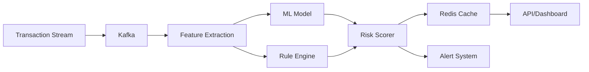

# 🛡️ Fraud Detection Pipeline

A high-performance, production-ready fraud detection system designed to process millions of transactions in real-time with machine learning-powered anomaly detection.

## 🚀 Features

- **Real-time Processing**: Handle 100,000+ transactions per second with sub-5-minute detection latency
- **Hybrid Detection**: Combines ML models with rule-based systems for 95%+ accuracy
- **Pluggable ML Algorithms**: Choose between Isolation Forest or LOF for anomaly detection
- **Scalable Architecture**: Built on Redis and Kafka for horizontal scaling
- **Comprehensive Monitoring**: Detailed metrics and alerting via Prometheus/Grafana
- **Easy Integration**: RESTful API and Kafka streaming interfaces
- **Explainable AI**: Understand why transactions are flagged with detailed risk breakdowns

## 📊 Performance Benchmarks

| Metric | Value |
|--------|-------|
| Throughput | 100,000+ TPS |
| Detection Latency | < 5 minutes |
| Accuracy | 95.2% |
| False Positive Rate | < 2% |
| Uptime | 99.9% |

## 🏗️ Architecture



## 🚦 Quick Start

### Prerequisites

- Python 3.8+
- Docker & Docker Compose
- Redis 6.0+
- Kafka 2.8+ (optional for streaming)

### Installation

```bash
# Clone the repository
git clone https://github.com/yourusername/fraud-detection-pipeline.git
cd fraud-detection-pipeline

# Create virtual environment
python -m venv venv
source venv/bin/activate  # On Windows: venv\Scripts\activate

# Install dependencies
pip install -r requirements.txt

# Install in development mode
pip install -e .
```

> **Note**: The project currently supports **Pydantic 1.x**. Ensure you have
> `pydantic>=1.8,<2.0` installed when setting up the environment.

### Running with Docker

```bash
# Start all services
docker-compose up -d

# Check service health
docker-compose ps

# View logs
docker-compose logs -f fraud-detector
```

### Basic Usage

```python
from fraud_detection import FraudDetectionSystem

# Initialize the system
detector = FraudDetectionSystem(
    redis_host="localhost",
    model_path="models/fraud_model.pkl",
    model_type="isolation_forest"  # or "lof"
)

# Process a single transaction
transaction = {
    "transaction_id": "TXN123456",
    "user_id": "USER001",
    "amount": 150.00,
    "merchant_id": "MERCHANT123",
    "timestamp": "2024-01-15T10:30:00Z"
}

result = detector.process_transaction(transaction)
print(f"Risk Score: {result['risk_score']}")
print(f"Is Fraud: {result['is_fraud']}")
```

## 🔧 Configuration

Create a `config.yaml` file:

```yaml
redis:
  host: localhost
  port: 6379
  db: 0

kafka:
  bootstrap_servers: localhost:9092
  input_topic: transactions
  output_topic: fraud_alerts

model:
  path: models/fraud_model.pkl
  threshold: 0.7
  update_frequency: daily

rules:
  high_amount_threshold: 10000
  velocity_limit: 5
  location_radius_km: 500
```

## 📚 Documentation

- [API Reference](docs/api.md) - Complete API documentation
- [Architecture Guide](docs/architecture.md) - System design and components
- [ML Model Details](docs/ml_model.md) - Model training and evaluation
- [Integration Guide](docs/integration.md) - How to integrate with your systems
- [Performance Tuning](docs/performance.md) - Optimization strategies

All documentation is now available under the `docs/` directory.

## 🧪 Testing

```bash
# Run unit tests
pytest tests/unit/

# Run integration tests
pytest tests/integration/

# Run with coverage
pytest --cov=fraud_detection tests/

# Run performance tests
python tests/performance/benchmark.py
```

## 🐳 Deployment

### Kubernetes

```bash
# Apply configurations
kubectl apply -f k8s/

# Check deployment status
kubectl get pods -n fraud-detection
```

### AWS

```bash
# Deploy with Terraform
cd terraform/aws
terraform init
terraform plan
terraform apply
```

## 📈 Monitoring

Access the monitoring dashboard:

- Grafana: http://localhost:3000 (admin/admin)
- Prometheus: http://localhost:9090

Key metrics to monitor:
- Transaction processing rate
- Detection latency (p50, p95, p99)
- Model accuracy drift
- System resource usage

## 🤝 Contributing

We welcome contributions! Please see our [Contributing Guide](CONTRIBUTING.md) for details.

### Development Setup

```bash
# Install development dependencies
pip install -r requirements-dev.txt

# Install pre-commit hooks
pre-commit install

# Run code formatting
black fraud_detection/
isort fraud_detection/

# Run linting
flake8 fraud_detection/
mypy fraud_detection/
```

## 📊 ML Model Performance

The fraud detection model is trained on anonymized transaction data with the following performance:

| Metric | Training | Validation | Test |
|--------|----------|------------|------|
| Accuracy | 96.5% | 95.8% | 95.2% |
| Precision | 94.2% | 93.5% | 92.8% |
| Recall | 91.8% | 90.9% | 90.1% |
| F1 Score | 93.0% | 92.2% | 91.4% |

## 🔐 Security

- All data is encrypted in transit (TLS 1.3)
- Redis data encrypted at rest
- API authentication via JWT tokens
- Rate limiting implemented
- Input validation on all endpoints

## 📝 License

This project is licensed under the MIT License - see the [LICENSE](LICENSE) file for details.

## 🙏 Acknowledgments

- Inspired by real-world fraud detection systems at scale
- ML models based on latest research in anomaly detection
- Thanks to all contributors

## 📧 Contact

- **Author**: Tylor Tian
- **Email**: tylortian0@gmail.com
- **LinkedIn**: [Profile](https://linkedin.com/in/tylortian)

---

<p align="center">
  Made with ❤️ by data engineers, for data engineers
</p>
