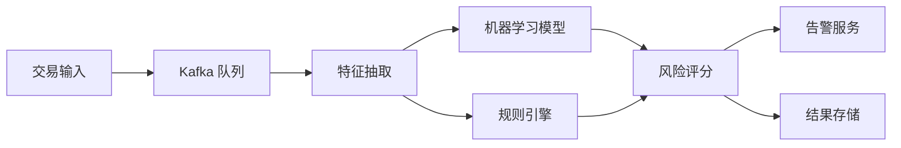

# 系统架构

以下示意图展示了欺诈检测管道的核心组件：

```mermaid
graph LR
    A[交易输入] --> B[Kafka 队列]
    B --> C[特征抽取]
    C --> D[机器学习模型]
    C --> E[规则引擎]
    D --> F[风险评分]
    E --> F
    F --> G[告警服务]
    F --> H[结果存储]
```

系统以 Kafka 作为消息总线，特征抽取后同时进入规则引擎和 ML 模型，
两者结果综合生成最终风险评分并写入存储，供 API 与监控组件查询。
