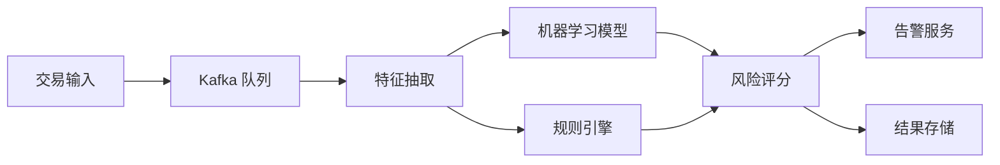

# 系统架构

以下示意图展示了欺诈检测管道的核心组件：

```mermaid
graph LR
    A[交易输入] --> B[Kafka 队列]
    B --> C[特征抽取]
    C --> D[机器学习模型]
    C --> E[规则引擎]
    D --> F[风险评分]
    E --> F
    F --> G[告警服务]
    F --> H[结果存储]
```

文档待补充
